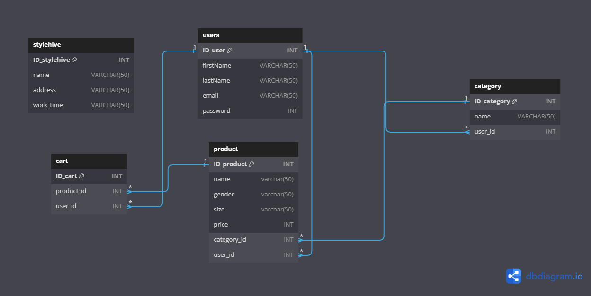



*Koristene tehnologije*

- Spring Boot programsko okruženje
- Relacijske baze podataka (MySQL), kao što je MySQL
- Docker tehnologija
- Oracle Cloud Platform (OCP)e
- IntelliJ IDEA razvojno okruženje

*Model baze* 

*Tehnologije* 

# StyleHive
